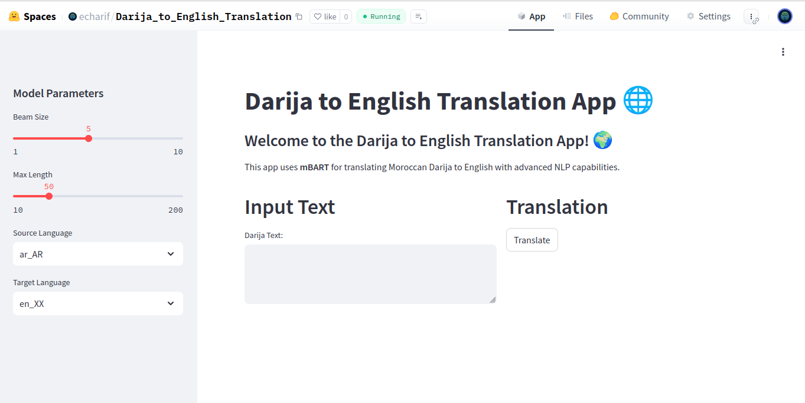

# Fine-Tuning mBART for Moroccan Darija ↔ English Translation

## Project Overview

This project focuses on fine-tuning the multilingual mBART model (`facebook/mbart-large-50-many-to-many-mmt`) for translation between Moroccan Darija and English. Moroccan Darija, a spoken dialect of Arabic, is underrepresented in machine translation systems. This work aims to address that by adapting a large multilingual transformer model using a custom parallel corpus.

Alongside the training pipeline, a simple web-based translation interface was built using Streamlit and deployed to **Hugging Face Spaces**. The trained model was also uploaded to the **Hugging Face Hub** to make it publicly accessible and easily integrated into other applications.

## Goals

* Fine-tune mBART on a custom Moroccan Darija–English parallel dataset.
* Improve translation quality for Darija, a low-resource language.
* Provide an easy-to-use web app for real-time translation.
* Host the model and demo openly for the community.

## Tools & Libraries Used

* **Transformers (Hugging Face)** – Tokenizer, model, training loop
* **Datasets (Hugging Face)** – Dataset handling and preprocessing
* **PyTorch** – Training backend
* **scikit-learn** – Dataset splitting
* **pandas / numpy** – Data manipulation
* **sacrebleu** – Evaluation metric
* **Streamlit** – Interactive web interface
* **Hugging Face Hub / Spaces** – Model and app deployment

## Workflow

### 1. Environment Setup

Install necessary packages:

```bash
!pip install transformers datasets sacrebleu streamlit
```

### 2. Data Preparation

* Load CSV dataset with parallel text (`darija`, `english`).
* Split into training, validation, and test sets.
* Convert to `DatasetDict` format for Hugging Face training.

### 3. Tokenization

* Use mBART tokenizer with language codes:

  * `ar_AR` for Darija
  * `en_XX` for English
* Apply padding and truncation during preprocessing.

### 4. Model Setup

* Load `facebook/mbart-large-50-many-to-many-mmt`.
* Configure training arguments with learning rate, batch size, evaluation strategy, etc.
* Use `Seq2SeqTrainer` for training and evaluation.

### 5. Evaluation

* Generate translations on the validation/test set.
* Evaluate performance using `sacrebleu`.
* Include sample outputs for qualitative assessment.

### 6. Inference

* Define a function to translate arbitrary input text.
* Allow switching translation direction based on language.

### 7. Interface & Deployment

* A **Streamlit app** was developed for real-time demo.
* The app is hosted on **Hugging Face Spaces**.
* The fine-tuned model was uploaded to the **Hugging Face Hub** for public use.

## Results

* Fine-tuning significantly improved translation quality compared to the base mBART.
* Achieved good BLEU scores on validation and test sets.
* The model generalized well on unseen Darija expressions and informal speech.

## App Demo


*Simple Streamlit interface for real-time Darija ↔ English translation.*


## Target Audience

* Machine Learning and NLP engineers
* Arabic NLP researchers
* Developers working on low-resource languages
* Students and professionals building NLP portfolios

## Author & Credits

**Author:** Charif El Belghiti<br>
**Model:** [Available on Hugging Face Hub](https://huggingface.co/echarif/mBART_for_darija_transaltion)<br>
**Demo:** [Live on Hugging Face Spaces](https://huggingface.co/spaces/echarif/Darija_to_English_Translation)

